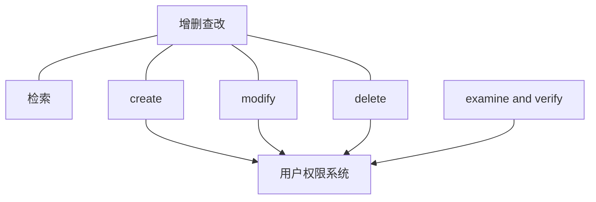
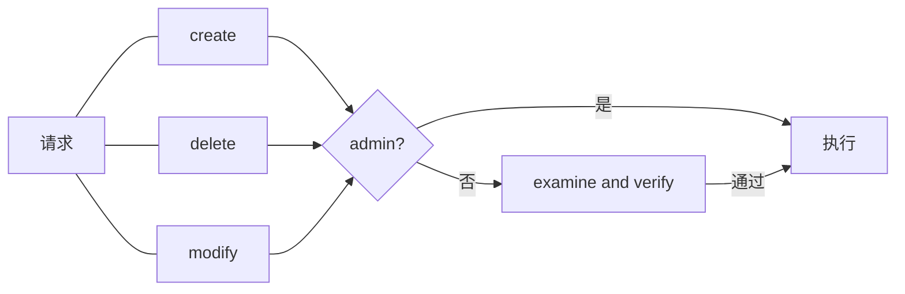

# resource management系统

该系统作为基础设施，对resource进行管理.

---
## 职能
对resource的信息、数据进行**增删查改**，对这些操作进行审核。
- [检索](./search/design.md)
- [create](#create)
- [delete](#delete)
- [modify](#modify)
- [examine and verify](./examine_and_verify/design.md)

**依赖**：

对同一对象的操作，delete优先级最高，检索优先级最低。

---

## 检索
设计文档：[search](./search/design.md)
对数据、信息进行搜索和综合。
权限要求：无
工作流（简化）如下图：

## create
新建**不存在的resource**.
接收以下内容：
- 类型.
- 数据.

## delete
删除**已存在的resource**.
接收一个UUID，删除对应的resource除`UUID`和`当前的revision_node的UID`.

## modify
修改**已存在的resource**的数据片段.
接收以下内容：
- UUID.
- 修改内容.

## examine and verify
设计文档：[examine_and_verify](./examine_and_verify/design.md)
对resource的修改请求提案的审核，可以传入一连串请求，作为单个提案.
每个提案至多有一个resource及其直接关联的resource的对象.
**流程**：
