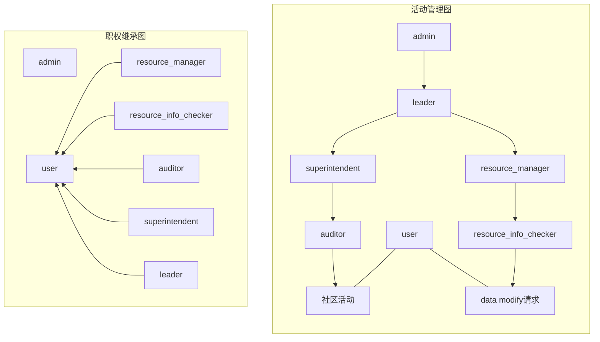

# User权限系统

`leader`,`auditor`,`superintendent`,`resource_info_checker`,`resource_manager`统称管理权限.
除`admin`外，所有管理权限的范围仅限于user所在group内.

---
**操作**
- [授权](授权)
- [卸任](#卸任)
- [黑名单](#黑名单)

**权限类别**
- [admin](#admin)
- [user](#user)
- [leader](#leader)
- 社区管理
    - [auditor](#auditor)
    - [superintendent](#superintendent)
- 信息
    - [resource_info_checker](#resource_info_checker)
    - [resource_manager](#resource_manager)

---

## 授权
提供一个UID和一种权限进行授权，一个账户至多有一个管理权限.

## 卸任
提供一个UID进行卸任，所提供的UID必须在提供者的管辖范围内（具体在API层展开）.

## 黑名单
黑名单的结构为：
- 账户UID.
- 封禁权限.

提供一个UID和管理权限填入或移出黑名单.
在黑名单内的账户自动卸下被封禁的权限.
在黑名单内的账户无法获取被封禁的权限.

---

## admin
应用层最高权限，**无视`examine and verify`**.
- 所有操作依然通过API执行.
- 不应可以登录，只可在服务器终端登录，对user账户不开放.
能力：
- 授予某个账户在所在group的leader权限.

## user
所有账户的基础权限，由多个权限组成.
能力：
- `comment`：发布评论的权限.
- `gain_permission`：获得管理权限的权限.
- `resource_rectify`：发出关于某个resource的修正请求.
- `create_personal_list`：创建个人列表，包括收藏夹、歌单等.

## leader
原则上只有一位.
职责：对所在group的一切活动负责，对所有用户进行管理.
能力：
- 授予或卸下某个账户`superintendent`,`resource_manager`权限.
- 授予或卸下某个账户的`gain_permission`.
- 终止或恢复所在的group.

## auditor
职能：
- 访问`compliance audit`系统.
- 对社交直接相关的信息进行审核.
- 可以对账户进行一个月以内的封禁，或某项社交功能时长三个月以内的中止（具体在compliance audit系统展开）.

## superintendent
职责：对*所有社区活动*进行管理并负责.
能力：
- 授予或卸下某个账户的`auditor`权限.
- 管理`auditor`黑名单.
- 封禁某个账户的`user`权限.
- 授予某个账户的`gain_permission`权限.
- 恢复所在的group.

## resource_info_checker
职能：
- 访问`examine and verify`系统.
- 对数据进行审查核实.

## resource_manager
职责：对*所有resource的数据*进行管理并负责.
能力：
- 授予或卸下某个账户的`resource_info_checker`权限.
- 管理`resource_info_checker`黑名单.
- 封禁或解封某个`user`的`resource_rectify`权限.
- 对数据进行组织、迁移.
- 授予某个账户的`gain_permission`权限.
- 恢复所在的group.