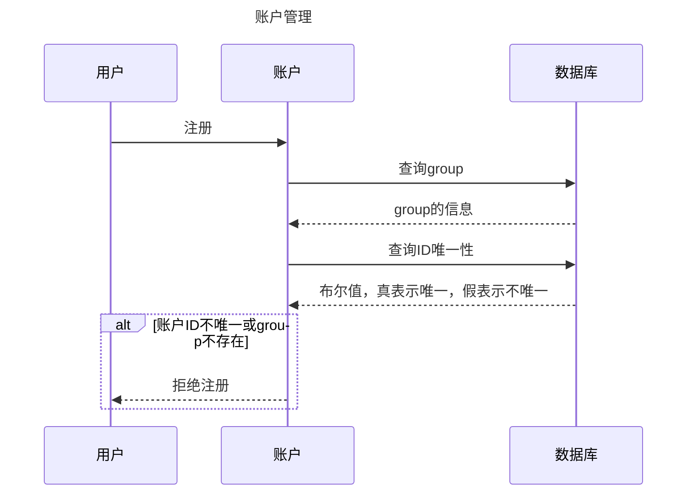

# User管理系统

该系统作为基础设施，用于管理user.

---
- [group](./group/design.md)
- [User](./user/design.md)
---

---
## group
设计文档：[group](./group/design.md)
User组成的集合.

## User
设计文档：[user](./user/design.md)  
必须在某个group下.